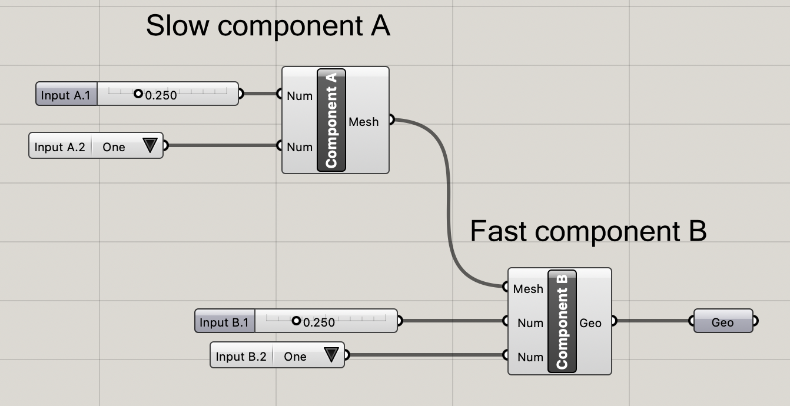
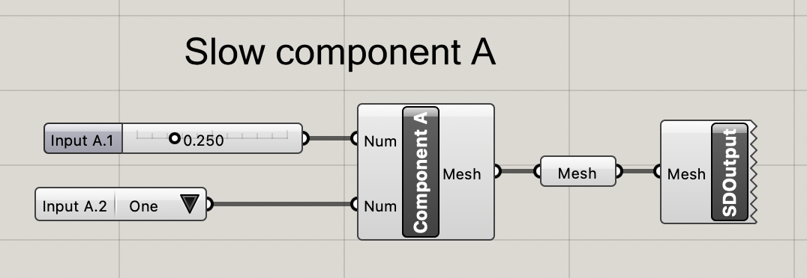
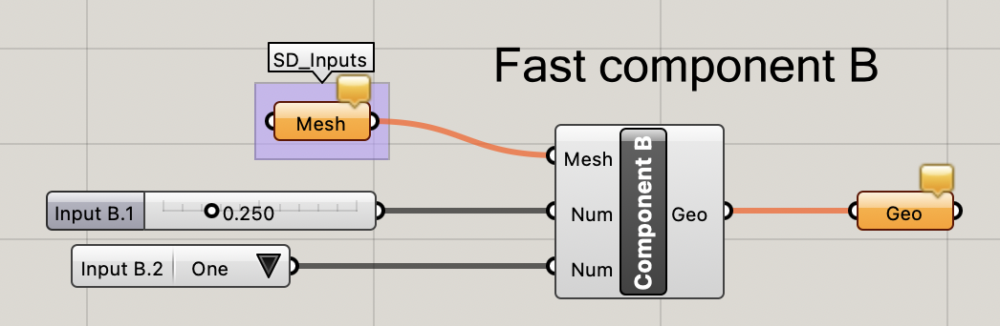

# TypeScriptSdkExample-sdTF-in-out
Basic example for linking ShapeDiver models (Grasshopper models hosted on ShapeDiver). In this context _linking_ refers to feeding outputs of one model to the inputs of another one. 

While this example uses a simple chain of two models, the mechanism explained is not limited to linear sequences of ShapeDiver models. On the contrary, it allows to build a network of linked models, resulting in a parametric 3D model on a macro level. 

## Why do we want to link models ?

Some of the most prominent reasons: 

### Maximize caching 

Speed matters. To maximize speed of your online application, it is important to avoid the repeated computation of results that have previously been computed. When running Grasshopper locally, you are the only user of your instance of Grasshopper. Therefore, components that have been computed previously and were not invalidated due to a parameter change are not recomputed. This is different when running your Grasshopper model on ShapeDiver. Typically your model gets loaded by several instances of Grasshopper on ShapeDiver, to allow for parallel computations. Consider the following model: 



If component A takes a long time to compute, and component B is rather fast, you don't want component A to be recomputed if the user of your online application changes parameters that only influence component B. When you work with your Grasshopper model locally, this will always be the case. However, if there are several users using your online application, it is not guaranteed that computations will always end up on the same instance of Grasshopper. The computation might be handled by an instance of Grasshopper whose latest state corresponds to different values of Input A.1 or Input A.2. Therefore, sometimes component A will have to be recomputed. 

Linking ShapeDiver models allows to avoid this, by splitting your model into several ones. 

### Parallelize 

When running Grasshopper locally, most of the computation happens on a single CPU core. While there are some components that use multi-threading, Grasshopper's solver never exploits possibilities of solving the graph in parallel (it never computes different components in parallel). Linking ShapeDiver models allows to do precisely this. 

### Divide and conquer

The model decomposition as explained above (to maximize caching and achieve parallelism) can be seen as a _divide and conquer_ approach to architecting your Grasshopper models. Linking ShapeDiver models results in a parametric model at a macro level, with the individual models becoming like clusters in a single Grasshopper model. 

## How does linking work ?

The key ingredient is the [ShapeDiver Output](https://help.shapediver.com/doc/shapediver-output) component, and corresponding [structured inputs](https://help.shapediver.com/doc/inputs-and-outputs#Defininginputs-Usefloatingparametersasstructuredinputs). You can imagine [ShapeDiver Output](https://help.shapediver.com/doc/shapediver-output) components like the outputs of a cluster in Grasshopper. Each ShapeDiver Output component can output an arbitrary number of Grasshopper data trees. When running on ShapeDiver, the output component produces a glTF file (for 3D visualisation) and an [sdTF file](https://help.shapediver.com/doc/sdtf-structured-data-transfer-format) (holding the data trees). 

On the other hand, [structured inputs](https://help.shapediver.com/doc/inputs-and-outputs#Defininginputs-Usefloatingparametersasstructuredinputs) are defined by Grasshopper's common floating parameter components (like `Mesh`, `Brep`, `Curve`, `Number`, etc). When running on ShapeDiver, this components can consume data trees fed into them from sdTF files. 

The example model shown above is split into two models: 

Model A:



Model B:



## About this example

The code in this repository shows how to link ShapeDiver models on the level of the [Geometry Backend API](https://help.shapediver.com/doc/geometry-backend), using the [TypeScript SDK](https://www.npmjs.com/package/@shapediver/sdk.geometry-api-sdk-v2). The code is suitable for backend applications coded in node.js, but can also be reused in frontend applications running in a browser. 

Note that in this example, computations of model B are not triggered automatically once computations of model A finish. We will demonstrate this using separate examples for linking models using the [ShapeDiver 3D Viewer](https://help.shapediver.com/doc/viewer) or [App Builder](https://help.shapediver.com/doc/shapediver-app-builder). 

## Usage

Install dependencies: 

```
npm i
```

Upload the example models [`CAD-to-sdTF.ghx`](Grasshopper/CAD-to-sdTF.ghx) and [`sdTF-to-glTF.ghx`](Grasshopper/sdTF-to-glTF.ghx) to ShapeDiver. 

Enable backend access on the model edit page (tab ["Developers"](https://help.shapediver.com/doc/developers-settings)) for both models.

Copy `.env.template` to `.env`. 

Fill in your values for `MODEL_VIEW_URL`, `BACKEND_TICKET_CAD_TO_SDTF` and `BACKEND_TICKET_SDTF_TO_GLTF`. 

Run the tool: 

Step 1: Converts a CAD file `Example-CAD-file.3dm` to an sdTF file `Example-sdTF-File.sdtf`.

```
npm run cli -- cadToSdtf Example-CAD-file.3dm Example-sdTF-File.sdtf
```

Step 2: Convert the sdTF file `Example-sdTF-File.sdtf` to a glTF file `Example-glTF-File.glb`.

```
npm run cli -- sdtfToGltf Example-sdTF-File.sdtf Example-glTF-File.glb
```

You can view the resulting glTF file by dragging & dropping it onto the [glTF monster](https://viewer.shapediver.com/v3/latest/gltf/index.html).

## Reuse the code

If you want to plug this to your own codebase, copy the functionality from [src/cadToSdtf.ts](src/cadToSdtf.ts) and [src/sdtfToGltf.ts](src/sdtfToGltf.ts).

## Food for thought

  * Adapt `CAD-to-sdTF.ghx` to include your specific conversion logic.  
  * Adapt `sdTF-to-glTF.ghx` to include your specific conversion logic.  
  

## How to get support

[Help Center](https://help.shapediver.com/)
[Community and Support](https://help.shapediver.com/doc/community-and-support)
